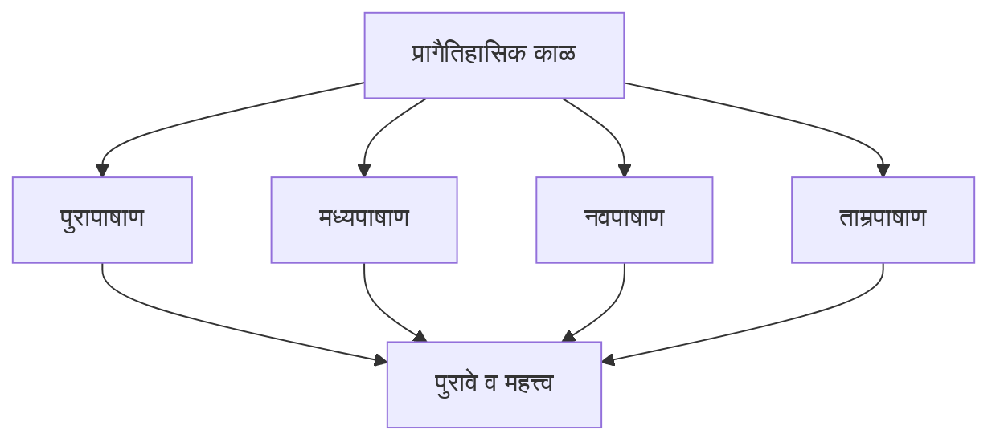

# दृश्य पुनरावृत्ती — प्रागैतिहासिक काळ

```mermaid
flowchart TD
 A["प्रागैतिहासिक काळ"] --> B["पुरापाषाण"]
 A --> C["मध्यपाषाण"]
 A --> D["नवपाषाण"]
 A --> E["ताम्रपाषाण"]
 B --> F["पुरावे व महत्त्व"]
 C --> F
 D --> F
 E --> F
```

## महत्त्वाचे की-वर्ड
- भीमबेटका
- मेहरगढ
- इनामगाव
