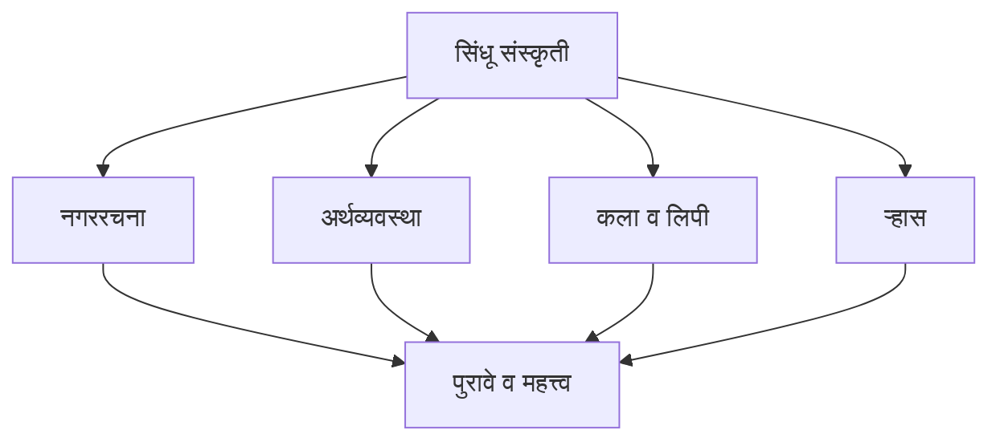

# दृश्य पुनरावृत्ती — सिंधू संस्कृती

```mermaid
flowchart TD
 A["सिंधू संस्कृती"] --> B["नगररचना"]
 A --> C["अर्थव्यवस्था"]
 A --> D["कला व लिपी"]
 A --> E["ऱ्हास"]
 B --> F["पुरावे व महत्त्व"]
 C --> F
 D --> F
 E --> F
```

## महत्त्वाचे की-वर्ड
- हडप्पा
- मोहेंजोदडो
- धोलावीरा
- लोथल
