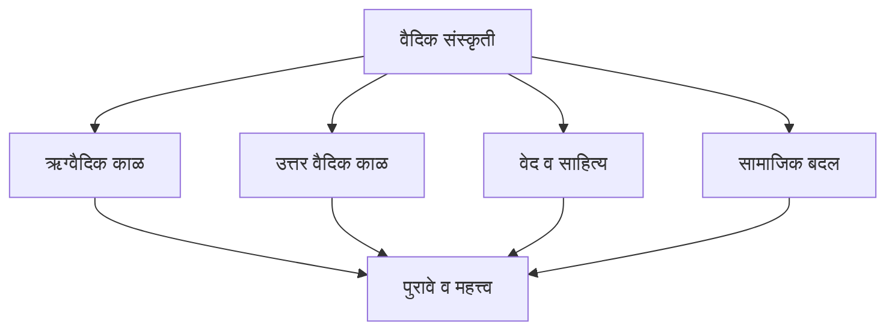

# दृश्य पुनरावृत्ती — वैदिक संस्कृती

```mermaid
flowchart TD
 A["वैदिक संस्कृती"] --> B["ऋग्वैदिक काळ"]
 A --> C["उत्तर वैदिक काळ"]
 A --> D["वेद व साहित्य"]
 A --> E["सामाजिक बदल"]
 B --> F["पुरावे व महत्त्व"]
 C --> F
 D --> F
 E --> F
```

## महत्त्वाचे की-वर्ड
- ऋग्वेद
- सभा
- समिती
- उपनिषदे
